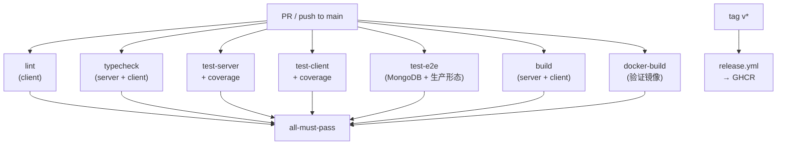

# 阶段三 Task 3：CI/CD 流水线 — 详细实施计划

> **目标**：PR 提交后 GitHub Actions 自动跑 typecheck → lint → test → build → docker-build，全绿方可合并；打 tag `v*` 自动构建并推送镜像到 GHCR。
> **范围**：新增 `.github/workflows/*.yml`，补齐 server 端 ESLint，配置 PR 模板与分支保护规则指南。
> **原则**：CI 中复用已有 npm scripts（`test`/`build`/`typecheck`/`lint`），不引入新的构建工具；e2e 在 CI 中走"生产形态"（server 静态托管 client dist），与 `compose.e2e.yml` 互补。

---

## 目录

- [0. 现状核对](#0-现状核对)
- [1. 关键设计决策](#1-关键设计决策)
- [2. 前置修复（P0）](#2-前置修复p0)
- [3. 交付物清单与逐文件实现](#3-交付物清单与逐文件实现)
- [4. 执行顺序](#4-执行顺序)
- [5. 验证清单](#5-验证清单)
- [6. 风险与规避](#6-风险与规避)
- [7. 验收对照表](#7-验收对照表)
- [8. 待确认决策](#8-待确认决策)

---

## 0. 现状核对

| 检查项 | 现状 | 影响 |
|---|---|---|
| `.github/workflows/` | **空目录**（仅有 `.github/ISSUE_TEMPLATE/user-story.md`） | 从零开始 |
| Git remote | **无远程仓库**（`git remote -v` 为空） | CI 无法触发，需先建 GitHub 仓库 |
| Server ESLint | **无配置**（server/ 下无 eslint.config.*） | CI 的 lint job 只能覆盖 client |
| Client ESLint | `client/eslint.config.js`（flat config，ESLint 9 风格） | ✅ 可直接用 `npm run lint` |
| Server scripts | `typecheck` / `build` / `test` / `test:coverage` | ✅ CI 可直接复用 |
| Client scripts | `lint` / `typecheck` / `build` / `test` / `test:coverage` / `test:e2e` | ✅ |
| Server 测试 | 115 个，依赖 `mongodb-memory-server`（自动下载二进制） | CI 中需缓存或预下载 |
| Client 测试 | 78 个，纯 jsdom + MSW，无外部依赖 | ✅ CI 无障碍 |
| e2e 测试 | 14 个，依赖 MongoDB + server + client | CI 需 service container + 构建产物 |
| Playwright 配置 | 支持 `PLAYWRIGHT_BASE_URL` + `CI` 环境变量 | ✅ CI 友好 |
| Dockerfile | 根目录 4-stage 多阶段构建 | ✅ CI 中 `docker build .` 验证 |
| Node 版本 | 本机 v20.18.1，Docker 用 node:22-alpine | CI 统一用 Node 22 |
| 包管理器 | **npm**（非 yarn），有 `package-lock.json` | CI 用 `npm ci` |
| `fileParallelism` | server vitest 设为 `false`（共享内存 DB） | CI 中同样需要 |
| 覆盖率报告 | 两端均配置 `@vitest/coverage-v8`，reporter `text` + `lcov` | CI 可上传 |

---

## 1. 关键设计决策

### 1.1 CI 触发策略

| 事件 | 触发工作流 | 目的 |
|---|---|---|
| `push` to `main` | `ci.yml` | 主干持续集成 |
| `pull_request` to `main` | `ci.yml` | PR 门禁 |
| `push` tag `v*` | `release.yml` | 发布镜像到 GHCR |
| 手动 `workflow_dispatch` | `ci.yml` + `release.yml` | 按需重跑 |

### 1.2 Job 拓扑



**决策：所有 job 并行执行**（无依赖关系），每个 job 独立失败。这样：
- 快速反馈（最慢的 job 决定总时长，而非串行累加）
- 定位精确（哪个 job 挂了一目了然）
- 各 job 用独立的 `actions/checkout` + `setup-node` + `npm ci`，不共享 workspace

### 1.3 e2e 在 CI 中的运行策略

**方案：生产形态 e2e**（推荐，与 `compose.e2e.yml` 互补）

```
GitHub Actions Runner
├── MongoDB service container (mongo:7, port 27017)
├── Build client → client/dist
├── Start server (CLIENT_DIST=client/dist, MONGO_URI=mongodb://localhost:27017)
└── Run Playwright (PLAYWRIGHT_BASE_URL=http://localhost:3001)
```

**为什么不走 docker compose**：
- GitHub Actions 的 service container 对单容器更稳定
- 走 `docker compose up` 需要在 job 内嵌 Docker-in-Docker，复杂且慢
- 生产形态 e2e 覆盖了"同源部署"路径，与 Task 2 的方案 A 一致

**为什么不走 dev 双服务**：
- dev 模式需要 `ts-node`（慢）+ `vite`（热编译），CI 中不稳定
- 生产形态用编译后的 `node dist/server.js`，启动快、行为与线上一致

### 1.4 覆盖率上报

- **方案 A（推荐）**：用 `actions/upload-artifact` 上传 `coverage/` 目录到 GitHub Actions Artifacts，PR 中手动查看
- **方案 B（可选）**：接入 Codecov / Coveralls，PR 中自动评论覆盖率变化

> 决策：先走方案 A（零外部依赖），后续如需 PR 评论再接 Codecov。

### 1.5 Node 版本

统一 **Node 22**（与 Dockerfile 的 `node:22-alpine` 一致），用 `actions/setup-node@v4`。

### 1.6 Server 端 ESLint

Server 目前无 ESLint 配置。两个选择：

| | 方案 A：最小 ESLint | 方案 B：仅用 typecheck |
|---|---|---|
| 新增文件 | `server/eslint.config.js` | 无 |
| 检查能力 | 未使用变量 + 最佳实践 | 仅类型错误 |
| 复杂度 | 需安装 eslint devDep + 配置 | 零 |
| 与 client 一致性 | ✅ 两端都有 lint | ❌ 不一致 |

> **决策：走方案 A**，给 server 加一个最小 ESLint flat config（仅 `@eslint/js` recommended + `no-unused-vars`），与 client 风格对齐。

---

## 2. 前置修复（P0）

### P0-1 Server 端 ESLint 配置

**新增** `server/eslint.config.js`：
```js
import js from '@eslint/js'
import globals from 'globals'

export default [
  { ignores: ['dist/', 'node_modules/', 'coverage/'] },
  {
    files: ['src/**/*.ts'],
    extends: [js.configs.recommended],
    languageOptions: {
      ecmaVersion: 2022,
      sourceType: 'commonjs',
      globals: { ...globals.node },
    },
    rules: {
      'no-unused-vars': ['error', { varsIgnorePattern: '^[A-Z_]' }],
    },
  },
]
```

**安装** server devDeps：
```bash
cd server && npm install -D eslint@^9.0.0
```

**更新** `server/package.json` scripts：
```jsonc
"lint": "eslint src/"
```

**验证**：`cd server && npm run lint` exit 0（如有 lint 错误则修复或暂时 `// eslint-disable` 标注）。

### P0-2 确认 server lint 通过

实测前需跑一次 `npm run lint` 看是否有未使用变量等问题。若有，逐个修复（不 suppression，除非有正当理由）。

---

## 3. 交付物清单与逐文件实现

### 3.1 `.github/workflows/ci.yml`（主流水线）

```yaml
name: CI

on:
  push:
    branches: [main]
  pull_request:
    branches: [main]
  workflow_dispatch:

concurrency:
  group: ci-${{ github.ref }}
  cancel-in-progress: true

jobs:
  # ─────────────────────────────────────────────
  # Job 1: Lint（client + server）
  # ─────────────────────────────────────────────
  lint:
    name: Lint
    runs-on: ubuntu-latest
    steps:
      - uses: actions/checkout@v4

      - uses: actions/setup-node@v4
        with:
          node-version: 22
          cache: npm
          cache-dependency-path: |
            client/package-lock.json
            server/package-lock.json

      # Client lint
      - name: Client - Install
        working-directory: client
        run: npm ci
      - name: Client - Lint
        working-directory: client
        run: npm run lint

      # Server lint
      - name: Server - Install
        working-directory: server
        run: npm ci
      - name: Server - Lint
        working-directory: server
        run: npm run lint

  # ─────────────────────────────────────────────
  # Job 2: Typecheck（server + client）
  # ─────────────────────────────────────────────
  typecheck:
    name: Typecheck
    runs-on: ubuntu-latest
    steps:
      - uses: actions/checkout@v4
      - uses: actions/setup-node@v4
        with:
          node-version: 22
          cache: npm
          cache-dependency-path: |
            client/package-lock.json
            server/package-lock.json

      - name: Server - Install & Typecheck
        working-directory: server
        run: |
          npm ci
          npm run typecheck

      - name: Client - Install & Typecheck
        working-directory: client
        run: |
          npm ci
          npm run typecheck

  # ─────────────────────────────────────────────
  # Job 3: Server 单元测试 + 覆盖率
  # ─────────────────────────────────────────────
  test-server:
    name: Test (server)
    runs-on: ubuntu-latest
    steps:
      - uses: actions/checkout@v4
      - uses: actions/setup-node@v4
        with:
          node-version: 22
          cache: npm
          cache-dependency-path: server/package-lock.json

      - name: Install
        working-directory: server
        run: npm ci

      - name: Test with coverage
        working-directory: server
        run: npm run test:coverage

      - name: Upload coverage
        if: always()
        uses: actions/upload-artifact@v4
        with:
          name: coverage-server
          path: server/coverage/
          retention-days: 14

  # ─────────────────────────────────────────────
  # Job 4: Client 单元测试 + 覆盖率
  # ─────────────────────────────────────────────
  test-client:
    name: Test (client)
    runs-on: ubuntu-latest
    steps:
      - uses: actions/checkout@v4
      - uses: actions/setup-node@v4
        with:
          node-version: 22
          cache: npm
          cache-dependency-path: client/package-lock.json

      - name: Install
        working-directory: client
        run: npm ci

      - name: Test with coverage
        working-directory: client
        run: npm run test:coverage

      - name: Upload coverage
        if: always()
        uses: actions/upload-artifact@v4
        with:
          name: coverage-client
          path: client/coverage/
          retention-days: 14

  # ─────────────────────────────────────────────
  # Job 5: E2E 测试（生产形态）
  # ─────────────────────────────────────────────
  test-e2e:
    name: E2E Tests
    runs-on: ubuntu-latest
    services:
      mongo:
        image: mongo:7
        ports:
          - 27017:27017
        options: >-
          --health-cmd "mongosh --quiet --eval 'db.adminCommand(\"ping\").ok'"
          --health-interval 10s
          --health-timeout 5s
          --health-retries 5

    steps:
      - uses: actions/checkout@v4
      - uses: actions/setup-node@v4
        with:
          node-version: 22
          cache: npm
          cache-dependency-path: |
            client/package-lock.json
            server/package-lock.json

      # ── 构建前端 ──
      - name: Client - Install & Build
        working-directory: client
        run: |
          npm ci
          npm run build

      # ── 安装 Playwright 浏览器 ──
      - name: Install Playwright browsers
        working-directory: client
        run: npx playwright install --with-deps chromium

      # ── 构建并启动服务端（生产形态）──
      - name: Server - Install & Build
        working-directory: server
        run: |
          npm ci
          npm run build

      - name: Start server
        working-directory: server
        env:
          MONGO_URI: mongodb://localhost:27017
          DB_NAME: nexadoc_e2e
          JWT_SECRET: e2e-test-secret
          CLIENT_DIST: ../client/dist
          PORT: 3001
          CLIENT_ORIGIN: http://localhost:3001
        run: |
          node dist/server.js &
          sleep 3
          # 健康检查
          curl -sf http://localhost:3001/health || exit 1

      # ── 跑 e2e ──
      - name: Run E2E tests
        working-directory: client
        env:
          PLAYWRIGHT_BASE_URL: http://localhost:3001
        run: npx playwright test

      - name: Upload Playwright report
        if: always()
        uses: actions/upload-artifact@v4
        with:
          name: playwright-report
          path: client/playwright-report/
          retention-days: 14

  # ─────────────────────────────────────────────
  # Job 6: Build 验证
  # ─────────────────────────────────────────────
  build:
    name: Build
    runs-on: ubuntu-latest
    steps:
      - uses: actions/checkout@v4
      - uses: actions/setup-node@v4
        with:
          node-version: 22
          cache: npm
          cache-dependency-path: |
            client/package-lock.json
            server/package-lock.json

      - name: Server - Build
        working-directory: server
        run: |
          npm ci
          npm run build

      - name: Client - Build
        working-directory: client
        run: |
          npm ci
          npm run build

      - name: Verify no test files in dist
        run: |
          if find server/dist -name "*.test.js" | grep -q .; then
            echo "ERROR: test files found in server/dist"
            exit 1
          fi
          echo "OK: dist is clean"

      - name: Upload build artifacts
        uses: actions/upload-artifact@v4
        with:
          name: build-artifacts
          path: |
            server/dist/
            client/dist/
          retention-days: 7

  # ─────────────────────────────────────────────
  # Job 7: Docker 构建验证
  # ─────────────────────────────────────────────
  docker-build:
    name: Docker Build
    runs-on: ubuntu-latest
    steps:
      - uses: actions/checkout@v4

      - name: Build Docker image
        run: docker build -t NexaDoc:ci .

      - name: Verify image
        run: |
          docker run --rm NexaDoc:ci node -e "console.log('Node OK')"
          docker run --rm NexaDoc:ci ls /app/dist/server.js /app/public/index.html
```

**关键设计点**：
1. `concurrency` 防止同分支多次 push 重复跑
2. `cache: npm` + `cache-dependency-path` 缓存两端 npm 依赖
3. e2e job 用 service container 起 MongoDB，不用 Docker-in-Docker
4. server 启动后 `sleep 3` + `curl /health` 等待就绪
5. `if: always()` 确保覆盖率/报告即使测试失败也上传
6. `Verify no test files in dist` 防止 P0-2 回归

### 3.2 `.github/workflows/release.yml`（镜像发布）

```yaml
name: Release

on:
  push:
    tags: ['v*']
  workflow_dispatch:
    inputs:
      tag:
        description: 'Image tag (e.g. v1.0.0)'
        required: true

env:
  REGISTRY: ghcr.io
  IMAGE_NAME: ${{ github.repository }}

jobs:
  publish:
    name: Build & Push Image
    runs-on: ubuntu-latest
    permissions:
      contents: read
      packages: write

    steps:
      - uses: actions/checkout@v4

      - name: Set tag
        id: tag
        run: |
          if [ "${{ github.event_name }}" = "workflow_dispatch" ]; then
            echo "tag=${{ github.event.inputs.tag }}" >> $GITHUB_OUTPUT
          else
            echo "tag=${GITHUB_REF#refs/tags/}" >> $GITHUB_OUTPUT
          fi

      - name: Log in to GHCR
        uses: docker/login-action@v3
        with:
          registry: ${{ env.REGISTRY }}
          username: ${{ github.actor }}
          password: ${{ secrets.GITHUB_TOKEN }}

      - name: Extract metadata
        id: meta
        uses: docker/metadata-action@v5
        with:
          images: ${{ env.REGISTRY }}/${{ env.IMAGE_NAME }}
          tags: |
            type=raw,value=${{ steps.tag.outputs.tag }}
            type=raw,value=latest

      - name: Build and push
        uses: docker/build-push-action@v6
        with:
          context: .
          push: true
          tags: ${{ steps.meta.outputs.tags }}
          labels: ${{ steps.meta.outputs.labels }}
```

**关键设计点**：
1. 用 `GITHUB_TOKEN`（无需额外 secret），`permissions: packages: write` 授权推送
2. `docker/metadata-action` 自动生成 tag（`v1.0.0` + `latest`）
3. `workflow_dispatch` 支持手动指定 tag 重发
4. 镜像地址：`ghcr.io/<owner>/<repo>:v1.0.0` + `ghcr.io/<owner>/<repo>:latest`
5. 暂不做多架构（`platforms: linux/amd64,linux/arm64`）——需要 QEMU emulation，构建慢 3-5 倍；后续按需开启

### 3.3 `server/eslint.config.js`（P0-1 前置修复）

见 §2 P0-1。

### 3.4 `.github/PULL_REQUEST_TEMPLATE.md`

```markdown
## Summary

<!-- 1-3 句话描述本次变更 -->

## Change Type

- [ ] Bug fix
- [ ] New feature
- [ ] Refactor
- [ ] Test
- [ ] Docs
- [ ] CI/Infrastructure
- [ ] Breaking change

## Test Plan

<!-- 如何验证本次变更 -->

- [ ] `npm test` (server) passes
- [ ] `npm test` (client) passes
- [ ] `npm run typecheck` passes
- [ ] `npm run lint` passes
- [ ] Manual verification (describe below)

## Notes

<!-- 截图、关联 issue、breaking change 说明等 -->
```

### 3.5 `.github/ISSUE_TEMPLATE/bug-report.yml`（补充）

```yaml
name: Bug Report
description: Report a bug
labels: ["bug"]
body:
  - type: textarea
    id: description
    attributes:
      label: Description
      description: Clear description of the bug
    validations:
      required: true
  - type: textarea
    id: reproduce
    attributes:
      label: Steps to reproduce
      placeholder: |
        1. Go to...
        2. Click...
        3. See error
    validations:
      required: true
  - type: textarea
    id: expected
    attributes:
      label: Expected behavior
    validations:
      required: true
  - type: input
    id: browser
    attributes:
      label: Browser/OS
      placeholder: Chrome 130 / Windows 11
  - type: input
    id: version
    attributes:
      label: App version / commit
      placeholder: v1.0.0 or commit hash
```

### 3.6 `.github/ISSUE_TEMPLATE/feature-request.yml`（补充）

```yaml
name: Feature Request
description: Suggest a new feature
labels: ["enhancement"]
body:
  - type: textarea
    id: problem
    attributes:
      label: Problem
      description: What problem does this feature solve?
    validations:
      required: true
  - type: textarea
    id: solution
    attributes:
      label: Proposed solution
    validations:
      required: true
  - type: textarea
    id: alternatives
    attributes:
      label: Alternatives considered
```

### 3.7 分支保护规则（文档，非代码）

在计划文档中记录 GitHub 仓库设置步骤（无法通过 PR 自动化）：

```
Settings → Branches → Branch protection rules → main:
  ✅ Require status checks to pass before merging
     - Lint
     - Typecheck
     - Test (server)
     - Test (client)
     - E2E Tests
     - Build
     - Docker Build
  ✅ Require branches to be up to date before merging
  ✅ Require conversation resolution before merging
  ❌ Require approvals（个人项目可选，团队项目建议 1+）
```

---

## 4. 执行顺序

| Step | 内容 | 产出 | 验证 |
|---|---|---|---|
| **0** | P0-1：给 server 加 ESLint config + 安装 eslint devDep + `lint` script | `server/eslint.config.js` | `cd server && npm run lint` exit 0 |
| **1** | 创建 `.github/workflows/ci.yml` | 7 个 job 的主流水线 | YAML lint 通过（`yamllint` 或 GH Actions editor） |
| **2** | 创建 `.github/workflows/release.yml` | 镜像发布流水线 | YAML lint 通过 |
| **3** | 创建 `.github/PULL_REQUEST_TEMPLATE.md` + 补充 issue 模板 | PR/issue 模板 | GitHub UI 中可见 |
| **4** | 创建 GitHub 远程仓库 + 推送代码 | `git remote add origin ...` | `git push -u origin main` 成功 |
| **5** | 推一个测试分支，发起 PR，验证 CI 全绿 | CI 运行记录 | Actions tab 中 7 个 job 全绿 |
| **6** | 配置分支保护规则（§3.7） | main 分支保护 | PR 页面显示 "Required checks" |
| **7** | 打 tag `v0.1.0`，验证 release.yml 推送镜像到 GHCR | GHCR 镜像 | `docker pull ghcr.io/<owner>/<repo>:v0.1.0` |

### Step 0-3 可以在本地完成（不依赖 GitHub）
### Step 4-7 需要用户提供 GitHub 仓库名

---

## 5. 验证清单

```bash
# ── 本地验证（Step 0-3）──

# 1. Server lint
cd server && npm run lint              # exit 0

# 2. Client lint
cd client && npm run lint              # exit 0

# 3. 两端 typecheck
cd server && npm run typecheck         # exit 0
cd client && npm run typecheck         # exit 0

# 4. 两端 test
cd server && npm test                  # 115 passed
cd client && npm test                  # 78 passed

# 5. 两端 build
cd server && npm run build             # exit 0, dist 无 *.test.js
cd client && npm run build             # exit 0

# 6. YAML 语法
npx yamllint .github/workflows/ci.yml
npx yamllint .github/workflows/release.yml

# ── CI 验证（Step 5，需 GitHub 仓库）──

# 7. 推测试分支发 PR
git checkout -b test/ci-validation
git push origin test/ci-validation
# 在 GitHub UI 发起 PR → 等待 7 个 job 全绿 → 合并

# 8. E2E job 日志中确认
#    - MongoDB service container healthy
#    - server 启动后 /health 返回 200
#    - Playwright 14 passed

# 9. Release 验证（Step 7）
git tag v0.1.0
git push origin v0.1.0
# 等 release.yml 完成 → docker pull ghcr.io/<owner>/<repo>:v0.1.0
```

---

## 6. 风险与规避

| 风险 | 症状 | 规避 |
|---|---|---|
| `mongodb-memory-server` 下载慢/失败 | server test job 超时 | `setup-node` 的 `cache: npm` 已缓存依赖；如仍失败，加 `MONGOMS_VERSION` 环境变量固定版本 + 缓存 `~/.cache/mongodb-binaries` |
| Playwright 浏览器下载慢 | e2e job 超时 | `npx playwright install --with-deps chromium` 只装 Chromium（不装 Firefox/WebKit）；可加 `PLAYWRIGHT_BROWSERS_PATH` 缓存 |
| server 启动慢（等 MongoDB） | e2e job 中 `curl /health` 失败 | service container 已配 healthcheck；server 启动用 `sleep 3` + retry loop（最多等 30s） |
| Docker build 上下文过大 | docker-build job 慢 | `.dockerignore` 已排除 `node_modules`/`dist`/`docs`/`.git` |
| GitHub Actions 免费额度 | 大量 PR 耗尽 minutes | `concurrency` 取消旧运行；7 个 job 各 ~2-3 min，总 ~15-20 min/PR |
| 无 git remote | Step 4-7 无法执行 | Step 0-3 先在本地完成；Step 4 由用户创建仓库后继续 |
| npm ci 在 CI 中失败 | lockfile 不同步 | 本地先确认 `npm ci` 两端均可通过 |
| e2e 在 CI 中 flaky | 偶发超时 | Playwright 默认 retry 0，CI 中加 `retries: 2`（改 `playwright.config.ts`） |

---

## 7. 验收对照表

| 计划文档验收点 | 本计划对应 | 证据 |
|---|---|---|
| PR 提交后 CI 自动跑 lint/test/build | §3.1 ci.yml 7 jobs | GitHub Actions tab 全绿 |
| 全部 must-pass | §3.7 分支保护规则 | PR 页面 "Required checks" |
| e2e 在 CI 中可跑 | §3.1 Job 5 + service container | E2E job log: 14 passed |
| docker build 验证 | §3.1 Job 7 | Docker Build job green |
| 打 tag 发布镜像 | §3.2 release.yml | `docker pull ghcr.io/...` |
| 依赖矩阵（MongoDB service） | §3.1 test-e2e services | service container healthy |
| 覆盖率报告上传 | §3.1 upload-artifact | Artifacts tab 可下载 |

---

## 8. 待确认决策

1. **GitHub 仓库名**：`NexaDoc`。
2. **仓库可见性**：Public（免费 CI 无限额度）还是 Private（每月 2000 min）？→ 建议 Public。
3. **Codecov 接入**：本次是否接入？→ 建议先不接，用 GitHub Artifacts；后续 Task 5 再补。
4. **多架构镜像**：`release.yml` 是否同时构建 `linux/amd64` + `linux/arm64`？→ 建议先只做 amd64，后续按需。
5. **Playwright CI retries**：是否在 `playwright.config.ts` 中加 `retries: process.env.CI ? 2 : 0`？→ 建议加，减少 flaky。
6. **server lint 严格程度**：当前只开 `no-unused-vars` + recommended，是否需要加更多规则（如 `no-console` / `prefer-const`）？→ 建议先最小化，后续 Task 5 再收紧。

---

*本计划基于 2026-09-24 的实测核对撰写；所有"现状"结论均来自本仓库当前状态。*
